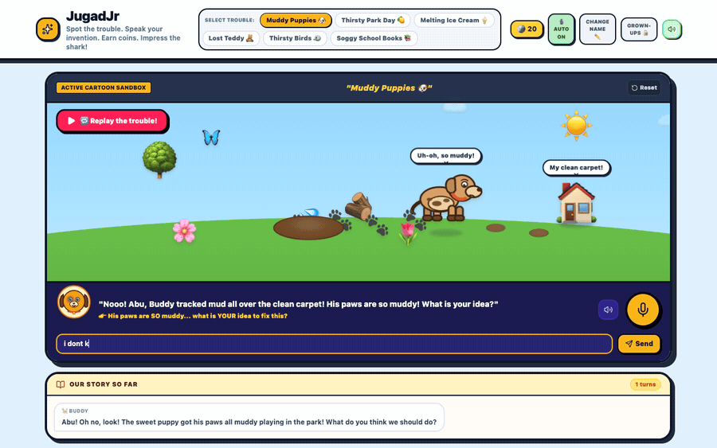

# JugadJr

**A Socratic tutor that cannot let a child give up — and scores how they think like a founder.**

Kids aged 5–11 watch a small trouble unfold in a cartoon world, say their own idea out loud, and watch the world change to match it. Then a shark investor reviews what they built.

🔗 **Live:** https://jugadjr-372821245947.europe-west1.run.app



*A real recorded session. The child types a trouble that is in none of the built-in list — "my little brother keeps losing his shoes and we are late for school" — and Gemini builds a world for it: the brother, a ticking clock, the school bus. Their answer, a shoe parking spot by the door, gets built into the scene.*

---

## The problem with AI tutors for kids

Give a child an LLM and one of two things happens. It hands them the answer, so they learn nothing. Or it keeps asking open-ended questions until the child gets frustrated and quits.

Both failure modes come from the same place: the model decides, turn by turn, how hard to push. Models are bad at that, and children have no patience for the times they get it wrong.

## What we built instead

JugadJr takes that decision away from the model.

Before every turn, the server counts how many times the child has answered and how many times in a row they've stalled — `"dunno"`, `"maybe"`, two words or fewer. That count selects a directive injected at the very top of the system prompt, above everything else:

| Situation | What the companion is forced to do |
|---|---|
| Engaging | Ask one fresh question, deeper than any asked before |
| Stuck once | Give one concrete sensory clue, then a genuinely new question |
| Stuck twice | Stop asking. Offer a specific idea and ask if they like it |
| Stuck 3× or 6 turns in | Stop entirely. Build the best available idea, celebrate, move on |

The model never chooses when to back off. The code does, deterministically. **A child cannot get stuck in JugadJr, and a child cannot be handed the answer early.** That guarantee is the product.

The moment they name any plausible fix — water, soap, a mat, a towel, a machine — it gets built into the scene, and their imperfect version always beats the model's perfect one.

## The child brings their own trouble

Six troubles ship with the game, but they are only a starting point. A child can speak or type any problem from their own life and the whole game builds itself around it — Gemini generates the scene, the characters, and the opening question.

We learned this the hard way. In the first play-test with real children, the part that landed hardest was not solving the trouble — it was *choosing* one. They immediately understood that a problem worth fixing could come from their own day. At the time, the UI only allowed the curated list. So it became the feature.

> *"my little brother keeps losing his shoes and we are late for school"*
> → **The Shoe Hunt** — the brother, a single shoe, a ticking clock, a school bus pulling away.

## The second half: do they think like a founder?

Once the trouble is solved, the game shifts into a `grow` phase and walks a fixed empathy ladder, one question per turn: *Who else has this problem? Do you want to help them? For free, or to earn a little? How would you tell people?*

Then **Shark Sana** reviews the whole transcript and scores three things:

- **Creativity** — was the invention actually theirs?
- **Business brain** — did they ever think about who pays?
- **Math sense** — did costs and earnings roughly line up?

Score 7+ and she invests. Every review ends positive. This is the parent-facing artifact: not "your child played for 20 minutes," but a read on how they reason.

Helping for free is scored as a win. The game never pushes money.

---

## How it uses Gemini

Gemini runs three jobs, all through structured JSON output:

**1. Scene director** (`/api/interact`) — turns a spoken or typed idea into a full array of positioned scene elements with animations and speech bubbles, plus the companion's line, coin costs, coins earned, and a `solved` flag. The response schema is enforced, so the game never parses prose.

**2. Ears** (`/api/transcribe`) — speech-to-text tuned for the actual users. The browser's built-in recogniser is Chrome-only and mishears young children and non-US accents constantly. Gemini is prompted to transcribe *without* correcting grammar or completing sentences, so a five-year-old's real words reach the game. Audio is captured with `MediaRecorder`, re-encoded in-browser to 16 kHz mono WAV, and posted as base64.

**3. Investor** (`/api/shark`) — reads the full conversation and returns the three scores, the verdict, and one practical tip.

### Degradation, everywhere

Nothing in this app is allowed to show a child an error.

- **Microphone denied or unsupported?** Every voice step has a typed equivalent, so the game is always playable without a mic.
- **No Gemini key, or no `MediaRecorder`?** Voice silently falls back to the Web Speech API.
- **Transcription fails?** That turn falls back to Web Speech.
- **Audio unintelligible?** The companion warmly asks again instead of stalling.
- **Model returns 429 or 404?** `MODEL_CHAIN` hops to the next Gemini model — free-tier quota is per model, so an exhausted bucket is not an outage.
- **Every model fails?** A canned in-character response keeps the story moving.

### Abuse control

`/api/interact`, `/api/transcribe` and `/api/shark` are rate-limited per IP per minute (20 / 30 / 6). The API key and the shared free-tier quota sit behind those routes.

---

## First run

Three cards state the point before anything loads or speaks: find a trouble, invent the fix, pitch it to the shark. Opening the app cold used to drop you into a cartoon park with a microphone and no explanation of what any of it was for — which is exactly how a judge or a parent meets it. Shown once per device, skippable.

---

## How it looks

**Characters are drawn, props are emoji.** The scene used to render every character as a system emoji. That had two problems: the art changed with the operating system — a judge on Windows saw entirely different characters than a judge on a Mac — and it clashed with the hand-drawn SVG companion sitting right underneath it in the talk bar.

Story-carrying characters (dog, child, bird, teddy) are now drawn in the companion's house style: thick outlines, flat fills, one highlight per eye. Incidental props stay emoji, which is fine — a flower carries no character.

Actors pick their mood from their own label and speech bubble, so the dog visibly droops and picks up mud splatters when muddy, then sparkles once the child's invention cleans him. No extra model call is involved.

**Animation follows the story, not a metronome.**

- New elements drop in with overshoot and settle, staggered across a batch. The child's idea appearing in the world is the most important moment in the game, and it used to just blink into existence.
- Bounce carries squash-and-stretch, so characters read as having weight.
- Scenery only breathes. Every tree and flower wiggling at full amplitude left the eye with nowhere to land; the characters should be what moves.
- Elements scale by ground position and stack by depth, so the world is no longer perfectly flat.

---

## Stack

React 19 + Vite + Tailwind 4 on the front, Express + `@google/genai` on the back, containerised and deployed to Google Cloud Run. No database — progress and coins live in `localStorage`.

```
server.ts                          API, curated troubles, prompt logic, silence gate, rate limiting
src/App.tsx                        game loop, canvas, voice capture, WAV encoding
src/index.css                      cartoon animation keyframes
src/components/IntroScreens.tsx    first-run explanation of the point
src/components/ParentGate.tsx      parental gate + grown-ups area
src/components/SceneActors.tsx     drawn characters, actor/mood resolution
src/components/CompanionAvatars.tsx  the four companions
scripts/record-demo.mjs            drives a real session to record the demo GIF
```

## Run locally

```bash
npm install
echo "GEMINI_API_KEY=your_key_here" > .env
npm run dev          # http://localhost:3000
```

Without a key the app still runs — curated scenes load, voice uses Web Speech, and the canned fallbacks stand in for the model.

```bash
npm run build && npm start   # production build
npm run lint                 # tsc --noEmit
```

## Adding a trouble

Append an entry to `CURATED_PROBLEMS` in both `server.ts` and `src/App.tsx`. Anything without a bespoke animation gets a generic "it gets worse, then we ask" opening beat automatically, and any character in it is picked up by `resolveActor` and drawn without extra wiring — new troubles are data, not code.

---

## Why "Jugad"

*Jugad* is the art of solving a real problem with whatever is actually in front of you. No budget, no permission, no perfect parts. That instinct is worth teaching, and it doesn't belong to any one country — every child everywhere has some of it before school trains it out of them.
